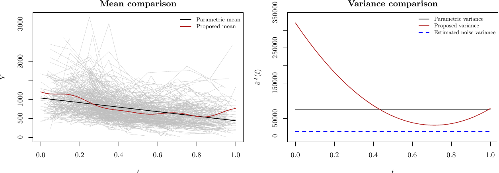
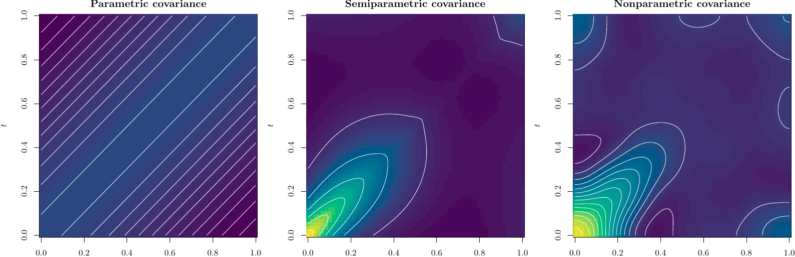
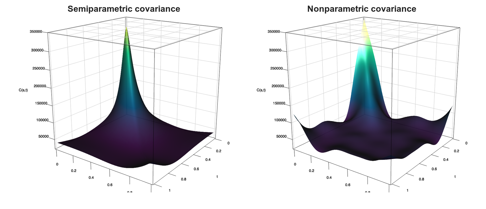

# Slide Pro-Tips

- `F`: fullscreen
- `S`: speaker view
- `E`: export to PDF
- `B`: pause to black screen
- `O`: overview
- `Z`: zoom
- `Alt` + click: zoom to region

::: {.notes}
Retained from the Braga revealjs talk. This is mainly a practical opening slide
for the presenter, and can be hidden late in preparation if preferred.
:::

# Abstract

We propose a semiparametric covariance estimator for sparsely observed
functional data.

The estimator decomposes the covariance surface into nonparametric marginal
scale functions and a structured correlation surface. The correlation component
is fit over a menu of interpretable positive-definite families and then averaged
using data-driven weights.

The resulting estimator is computationally attractive, retains flexibility where
the data are most informative, and provides a direct bridge between fully
parametric and fully nonparametric sparse FDA covariance estimation.

# Outline of Talk

1. Sparse FDA covariance: what makes the problem hard
2. A semiparametric decomposition
3. Nonparametric mean and variance estimation
4. Correlation families and model averaging
5. Finite-sample evidence
6. CD4 application
7. Summary and next steps

::: {.notes}
As in the 2024 talk, do not march through proofs line by line. The audience
should understand the estimator, why it is useful, and what the evidence says.
Proofs will be added to the manuscript separately.
:::

# Why Sparse FDA Covariance Is Hard

## Classical Versus Functional Data

Classical sample element:

$$
Y_i \in \mathbb R^d .
$$

Functional sample element:

$$
X_i = \{X_i(t): t \in \mathcal T\}.
$$

Sparse FDA observes only a small, noisy subset:

$$
Y_{ij} = X_i(T_{ij}) + \varepsilon_{ij},
        \qquad j=1,\ldots,m_i .
$$

::: {.notes}
This recreates the pedagogical opening used in Braga: begin with the sample
element before discussing estimators.
:::

## Sparse Curves

In dense FDA, each curve carries substantial within-subject information.

In sparse FDA, covariance information is distributed across many subjects.

The object of interest is the latent covariance function:

$$
\operatorname{cov}\{X_i(s),X_i(t)\},
$$

which is learned from irregularly placed within-subject pairs.

Replication matters.

## Measurement Error

Let

$$
C(s,t)=\operatorname{cov}\{X_i(s),X_i(t)\}
$$

denote the covariance function of the latent process $X$. 

The covariance of observations is not just this latent covariance:

$$
\operatorname{cov}(Y_{ij},Y_{ik})
= C(T_{ij},T_{ik}) + \sigma_\varepsilon^2 1\{j=k\}.
$$

The diagonal mixes latent variance and noise variance.

The off-diagonal is informative but can be sparse and unevenly distributed.

::: {.notes}
The left-hand side,
$\operatorname{cov}(Y_{ij},Y_{ik})$,
is the covariance of the observed noisy measurements, not the latent covariance function itself. Writing it explicitly makes the distinction clear:

observed covariance = latent covariance + measurement-error contribution
:::

## Why Direct Surface Smoothing Can Struggle

Fully nonparametric covariance estimation targets a two-dimensional surface:

$$
C(s,t), \qquad (s,t)\in\mathcal T^2 .
$$

That is flexible, but sparse designs can leave large regions weakly informed.

The estimator must manage:

- irregular design points,
- measurement error,
- positive-definiteness pressure,
- boundary behavior,
- computation.

# Proposed Semiparametric Decomposition

## The Object

Let

$$
\mu(t)=E\{X(t)\},
\qquad
\sigma^2(t)=\operatorname{var}\{X(t)\},
$$

and

$$
\rho(s,t)=\operatorname{corr}\{X(s),X(t)\}.
$$

Then

$$
C(s,t)=\sigma(s)\sigma(t)\rho(s,t).
$$

## The Main Idea

Estimate the location and marginal scale nonparametrically.

Estimate correlation semiparametrically:

$$
\widehat C(s,t)
= \widehat\sigma(s)\widehat\sigma(t)\widehat\rho(s,t).
$$

The scale functions absorb one-dimensional nonstationarity.

The correlation surface is constrained only through interpretable,
positive-definite correlation families.

## Why This Is Useful

This decomposition turns a difficult surface estimation problem into:

  1. two one-dimensional nonparametric regressions;
  2. one correlation-family fitting problem;
  3. a model-averaging problem over candidate correlation families.

The computational burden is closer to parametric fitting than to unrestricted
two-dimensional smoothing.

## A Statistical Compromise

Fully parametric covariance:

$$
C_\theta(s,t)
$$

can be too rigid.

Fully nonparametric covariance:

$$
\widehat C_{\mathrm{np}}(s,t)
$$

can be too variable under sparse designs.

The proposed estimator lives between these two extremes.

## Relation To Sparse FDA

The sparse FDA setting follows the measurement-error and random-design
framework used in the PACE literature [@Yao2005Sparse].

Our contribution is not curve recovery itself.

The focus is covariance estimation when one wants:

- interpretable correlation structure,
- flexible marginal variance,
- low computational cost,
- a route for model averaging.

# Nonparametric Mean and Variance

## Mean Estimation

The mean is estimated from pooled observations:

$$
\widehat\mu(t)
=\sum_{k=0}^{K}\widehat\theta_k \phi_k(t),
$$

Let $n=\sum_{i=1}^N M_i$ and let
$U_1\leq\cdots\leq U_n$ denote the ordered pooled observation times.

The coefficients are estimated from the aligned pooled responses, and the
basis is selected and truncated from the pooled sample.

The series step is one-dimensional and computationally inexpensive.

## Variance Estimation

After estimating the mean and noise variance, the latent marginal variance is
estimated through the variance pseudo-response

$$
Z_{ij}^{(v)}
=\{Y_{ij}-\mu(T_{ij})\}^2-\sigma_\varepsilon^2.
$$

The target is

$$
\sigma^2(t)
=E\{Z_{ij}^{(v)}\mid T_{ij}=t\}.
$$

The feasible version replaces $\mu$ and $\sigma_\varepsilon^2$ by estimates.

The noise variance is estimated using very local within-subject contrasts.

## Noise Variance

For close within-curve pairs, the latent curve is nearly unchanged, so
half-squared local differences mostly reflect measurement noise:

$$
D_{ijk}
=\frac12
\left[
\{Y_{ij}-\widehat\mu(T_{ij})\}
-\{Y_{ik}-\widehat\mu(T_{ik})\}
\right]^2 .
$$

Average the $k_{nn}$ within-curve pairs with the smallest time gaps
$|T_{ij}-T_{ik}|$:

$$
\widehat\sigma_\varepsilon^2
=\frac{1}{k_{nn}}\sum_{(i,j,k)\in\mathcal N_{k_{nn}}}D_{ijk}.
$$

The operational rule is deliberately simple:

$$
k_{nn} \asymp \log n,
\qquad n=\sum_{i=1}^N M_i.
$$

This exploits near-neighbor pairs while keeping the estimator computationally
light.

## Efromovich Cosine Series

Efromovich's cosine-series approach is attractive because the cosine basis is
orthonormal on $[0,1]$ and supports thresholding rules [@efromovich1999].

For $k\geq 0$,

$$
\phi_k(t)=
\begin{cases}
1, & k=0,\\
\sqrt{2}\cos(k\pi t), & k\geq 1 .
\end{cases}
$$

This basis is stable, fast, and surprisingly competitive in finite samples.

## The Boundary Issue

The cosine basis imposes

$$
\phi_k'(0)=\phi_k'(1)=0 .
$$

Any finite cosine expansion therefore has zero derivative at both endpoints.

That can be helpful when it is true.

It is restrictive when the mean or variance has genuine endpoint slope.

## Efromovich's Remedy

Efromovich discusses polynomial correction as a way to handle boundary
incompatibility [@efromovich1999, ch. 2].

The basic idea is:

1. represent low-order endpoint behavior with polynomial terms;
2. let the cosine tail estimate the remaining smooth component.

This preserves the spirit of the cosine estimator while relaxing the endpoint
constraint.

## Orthonormality Matters

Adding polynomial columns directly breaks the simple orthonormal structure that
motivates thresholded series estimation.

The remedy used here is to orthonormalize the finite set of boundary columns and
cosine columns.

Numerically, this is done with a QR/Gram-Schmidt construction
[@bjorck2015].

## Boundary-Corrected Basis

For a quadratic correction, start from

$$
\{1,\; t,\; t^2,\; \sqrt{2}\cos(\pi t),\ldots,
  \sqrt{2}\cos(L\pi t)\}.
$$

Then construct an orthonormal basis spanning the same finite space.

Linear correction allows a common endpoint slope.

Quadratic correction allows independent endpoint slopes.

## Why This Is Honest

The uncorrected cosine estimator is not naive.

It is a strong estimator when endpoint slopes are truly zero and is closely
related to modified Fourier ideas for nonperiodic functions.

Boundary correction is chosen because it avoids forcing zero derivatives at the
endpoints.

The price can be variance.

## Bias-Variance Tradeoff

In finite samples, boundary correction can increase integrated MSE even while
removing a visible endpoint distortion.

This is not a contradiction.

It is the familiar statistical tradeoff:

$$
\operatorname{MSE}(t)
= \operatorname{Bias}^2(t)+\operatorname{Var}(t).
$$

::: {.notes}
This wording mirrors the current manuscript stance: default boundary correction
is a defensible choice because it does not build in the zero-derivative prior.
:::

# Correlation Families

## Why Correlation Families?

Once $\sigma(t)$ is estimated, the remaining object is a correlation surface.

Correlation families encode shape:

- smoothness,
- local roughness,
- bridge-like behavior,
- varying scale,
- long-range decay.

They also help maintain positive-definite structure.

## Candidate Family Menu

The current candidate set includes:

| Family | Role |
|---|---|
| Matern | stationary smoothness and range |
| mfBm-shaped | nonstationary local roughness |
| Brownian bridge | tied-down covariance behavior |
| Rational quadratic | scale mixtures |
| Gibbs | spatially varying length-scale |
| Generalized Cauchy | long-range dependence |
| Generalized Wendland | compact support |

## Correlation Family Provenance

Examples include:

- Matern [@Matern1986]
- fractional Brownian motion [@MandelbrotVanNess1968]
- multifractional Brownian motion [@PeltierLevyVehel1995]
- Brownian bridge [@Doob1949]
- Gaussian-process families [@RasmussenWilliams2006; @Gibbs1997]
- generalized Cauchy [@LimTeo2009GeneralizedCauchy]
- generalized Wendland [@Wendland2005; @Bevilacqua2019GeneralizedWendland]

## Off-Diagonal Fitting

For subject $i$, form centered products

$$
Z_{ijk}
=\{Y_{ij}-\widehat\mu(T_{ij})\}
  \{Y_{ik}-\widehat\mu(T_{ik})\},
\qquad j\neq k.
$$

The off-diagonal avoids direct contamination by measurement error.

Candidate correlations are fit to standardized products.

## Model Averaging

Instead of selecting one correlation family, compute weights

$$
\widehat{\boldsymbol{\alpha}}
=\arg\min_{\boldsymbol{\alpha}\in\Delta}
\left\|
\widehat R-\sum_{\ell=1}^L \alpha_\ell R_\ell
\right\|^2,
$$

where $\Delta$ is the simplex.

This follows the spirit of focused/model-averaging ideas
[@CLAESKENS_HJORT:2011].

## Why Average?

Hard selection is brittle when families are close.

Model averaging allows:

- dominant weight on a good family,
- insurance when two families explain different regions,
- interpretable diagnostics via $\widehat\alpha$.

The averaging weights are part of the inferential output.

## Implementation Details {.smaller}

The default fit is data-driven rather than hand-tuned.

The main tuning choices are selected from the data:

- noise variance $(\sigma_\varepsilon^2)$: nearest within-subject contrasts
  with $k_{nn}\asymp \log n$;
- mean and variance functions $(\mu(t),\sigma^2(t))$: projection coefficients
  are estimated in an orthonormal boundary-corrected cosine-type basis; the
  boundary columns are retained, and a smoothed Efromovich threshold selects
  and shrinks the cosine tail;
- nonparametric covariance benchmark $(C(s,t))$: tensor order $J$ and roughness
  penalty $\lambda$ are selected jointly by curve-level cross-validation or by
  a NOMAD search over $(J,\log_{10}\lambda)$;
- correlation families $(\rho_\theta(s,t))$: low-dimensional parameters
  $\theta$ are fit from off-diagonal products, avoiding direct
  measurement-error contamination;
- model averaging $(\widehat\alpha)$: simplex weights are chosen by the same
  off-diagonal fitting criterion.

The demo call `spcovar(Lt, Ly)` uses these defaults.

# Parametric and Nonparametric Benchmarks

## Fully Parametric Benchmark

The fully parametric benchmark estimates:

$$
\mu_\eta(t),\qquad
\sigma^2_\gamma(t),\qquad
\rho_\theta(s,t).
$$

This is stable and fast when the structure is right.

It can be misleading when location, scale, or correlation is misspecified.

## Fully Nonparametric Benchmark

The nonparametric covariance benchmark estimates the surface directly:

$$
C(s,t).
$$

This is flexible, but the tensor problem is data-hungry under sparse sampling.

It is a useful competitor and a useful diagnostic.

## Combined-Test Diagnostic

The manuscript also compares convex combinations such as

$$
\lambda\widehat C_{\mathrm{param}}
+(1-\lambda)\widehat C_{\mathrm{sp}}.
$$

If the optimum places weight near one estimator, that is informative.

If it mixes, that is also informative.

# Finite-Sample Evidence

```{r peer-ratio-table-setup}
#| include: false
library(knitr)

pretty_simulation <- function(x) {
  map <- c(
    "Matern" = "Matérn",
    "GeneralizedCauchy" = "Generalized Cauchy",
    "GeneralizedWendland" = "Generalized Wendland",
    "RationalQuadratic" = "Rational Quadratic"
  )
  ifelse(x %in% names(map), unname(map[x]), x)
}

pretty_name <- function(x) {
  map <- c(
    "spcovar default" = "SP",
    "spcovar default minus DGP family" = "SP-OMIT",
    "Matern" = "Matérn",
    "PACE/fdapace" = "PACE",
    "mcfda Fourier" = "mcfda-F",
    "mcfda SP" = "mcfda-SP",
    "GeneralizedCauchy" = "GC",
    "GeneralizedWendland" = "GW",
    "RationalQuadratic" = "RQ",
    "npcovar" = "NP",
    "simulation" = "DGP"
  )
  if (x %in% names(map)) map[[x]] else x
}

make_peer_ratio_table <- function(dat,
                                  denominator,
                                  include_methods,
                                  sim_order,
                                  regime = NULL,
                                  digits = 2L) {
  if (!nrow(dat)) return(NULL)
  if (!is.null(regime)) {
    dat <- dat[dat$regime == regime, , drop = FALSE]
  }
  if (!nrow(dat)) return(NULL)

  denom <- dat[dat$method_label == denominator,
               c("simulation", "regime", "mean_mse_x1000")]
  names(denom)[3L] <- "den_mse"
  numer <- dat[dat$method_label %in% include_methods,
               c("simulation", "regime", "method_label", "mean_mse_x1000")]
  names(numer)[4L] <- "num_mse"
  merged <- merge(numer, denom, by = c("simulation", "regime"))
  merged <- merged[
    is.finite(merged$num_mse) &
      is.finite(merged$den_mse) &
      merged$num_mse > 0 &
      merged$den_mse > 0,
    ,
    drop = FALSE
  ]
  if (!nrow(merged)) return(NULL)
  merged$ratio <- merged$num_mse / merged$den_mse

  make_cell <- function(x) {
    if (!length(x)) return("")
    formatC(exp(mean(log(x))), digits = digits, format = "f")
  }

  rows <- list()
  for (sim in sim_order) {
    row <- c(simulation = sim)
    for (m in include_methods) {
      row[[m]] <- make_cell(merged$ratio[
        merged$simulation == sim & merged$method_label == m
      ])
    }
    rows[[length(rows) + 1L]] <- as.data.frame(as.list(row), stringsAsFactors = FALSE)
  }

  overall <- c(simulation = "Overall")
  for (m in include_methods) {
    overall[[m]] <- make_cell(merged$ratio[merged$method_label == m])
  }
  rows[[length(rows) + 1L]] <- as.data.frame(as.list(overall), stringsAsFactors = FALSE)

  out <- do.call(rbind, rows)
  names(out) <- c("simulation", include_methods)
  rownames(out) <- NULL
  out
}

reorder_table_by_row_values <- function(tab,
                                        row_value = "Overall",
                                        leading_cols = 1L,
                                        decreasing = FALSE) {
  if (is.null(tab) || !nrow(tab) || ncol(tab) <= leading_cols) return(tab)
  row_idx <- which(tab[[1L]] == row_value)
  if (!length(row_idx)) return(tab)
  ordered_cols <- seq.int(leading_cols + 1L, ncol(tab))
  scores <- suppressWarnings(as.numeric(tab[row_idx[1L], ordered_cols, drop = TRUE]))
  tab[, c(seq_len(leading_cols), ordered_cols[order(scores, decreasing = decreasing, na.last = TRUE)]), drop = FALSE]
}

render_peer_ratio_table <- function(tab) {
  if (is.null(tab) || !nrow(tab)) {
    cat("Peer comparison summary is not available.")
    return(invisible(NULL))
  }
  kable(
    tab,
    format = "html",
    align = c("l", rep("r", ncol(tab) - 1L)),
    col.names = vapply(names(tab), pretty_name, character(1L), USE.NAMES = FALSE),
    row.names = FALSE,
    escape = FALSE,
    table.attr = 'class="peer-ratio-table"'
  )
}

load_peer_campaign_summaries <- function(campaign_dir, cfg_env) {
  config_path <- file.path(campaign_dir, "campaign_config.R")
  results_dir <- file.path(campaign_dir, "results_full")
  if (!file.exists(config_path) || !dir.exists(results_dir)) return(data.frame())

  out <- list()
  for (key in cfg_env$campaign_dgp_keys()) {
    cfg <- cfg_env$campaign_dgp_config(key)
    for (multiplier in cfg_env$campaign_regime_multipliers) {
      regime_slug <- tolower(cfg_env$campaign_regime_label(multiplier))
      summary_path <- file.path(
        results_dir,
        key,
        sprintf("%s_%s_summary.csv", cfg$prefix, regime_slug)
      )
      if (!file.exists(summary_path)) next
      dat <- read.csv(summary_path, stringsAsFactors = FALSE)
      if (!nrow(dat)) next
      dat$simulation <- cfg$short_label
      dat$method_label <- unname(cfg_env$campaign_method_labels[dat$method])
      out[[length(out) + 1L]] <- dat
    }
  }
  if (!length(out)) data.frame() else do.call(rbind, out)
}

load_peer_campaign_alphas <- function(campaign_dir, cfg_env) {
  config_path <- file.path(campaign_dir, "campaign_config.R")
  results_dir <- file.path(campaign_dir, "results_full")
  if (!file.exists(config_path) || !dir.exists(results_dir)) return(data.frame())

  out <- list()
  for (key in cfg_env$campaign_dgp_keys()) {
    cfg <- cfg_env$campaign_dgp_config(key)
    for (multiplier in cfg_env$campaign_regime_multipliers) {
      regime_slug <- tolower(cfg_env$campaign_regime_label(multiplier))
      alpha_path <- file.path(
        results_dir,
        key,
        sprintf("%s_%s_alpha_summary.csv", cfg$prefix, regime_slug)
      )
      if (!file.exists(alpha_path)) next
      dat <- read.csv(alpha_path, stringsAsFactors = FALSE)
      if (!nrow(dat)) next
      dat$simulation <- cfg$short_label
      dat$method_label <- unname(cfg_env$campaign_method_labels[dat$method])
      out[[length(out) + 1L]] <- dat
    }
  }
  if (!length(out)) data.frame() else do.call(rbind, out)
}

build_peer_ratio_tables <- function(campaign_dir) {
  campaign_dir <- normalizePath(campaign_dir, mustWork = FALSE)
  config_path <- file.path(campaign_dir, "campaign_config.R")
  if (!file.exists(config_path)) {
    return(list(overall = NULL, N = NULL, `2N` = NULL, `4N` = NULL))
  }

  cfg_env <- new.env(parent = globalenv())
  source(config_path, local = cfg_env)

  summary_dat <- load_peer_campaign_summaries(campaign_dir, cfg_env)
  if (!nrow(summary_dat)) {
    return(list(overall = NULL, N = NULL, `2N` = NULL, `4N` = NULL))
  }

  summary_dat$simulation <- pretty_simulation(summary_dat$simulation)
  sim_order <- sort(pretty_simulation(vapply(
    cfg_env$campaign_dgp_keys(),
    function(key) cfg_env$campaign_dgp_config(key)$short_label,
    character(1L)
  )))
  peer_methods <- unname(cfg_env$campaign_method_labels[c(
    "npcovar_nomad",
    "face_sparse",
    "fdapace",
    "rkhscovfun_cv",
    "mcfda_fourier",
    "mcfda_sp"
  )])
  sp_methods <- unname(cfg_env$campaign_method_labels[c(
    "spcovar_default",
    "spcovar_default_minus_own_family"
  )])
  table_overall <- make_peer_ratio_table(
    summary_dat,
    denominator = sp_methods[1L],
    include_methods = c(sp_methods[2L], peer_methods),
    sim_order = sim_order
  )
  table_overall <- reorder_table_by_row_values(table_overall)
  ordered_methods <- names(table_overall)[-1L]
  table_N <- make_peer_ratio_table(
    summary_dat,
    denominator = sp_methods[1L],
    include_methods = ordered_methods,
    sim_order = sim_order,
    regime = "N"
  )
  table_2N <- make_peer_ratio_table(
    summary_dat,
    denominator = sp_methods[1L],
    include_methods = ordered_methods,
    sim_order = sim_order,
    regime = "2N"
  )
  table_4N <- make_peer_ratio_table(
    summary_dat,
    denominator = sp_methods[1L],
    include_methods = ordered_methods,
    sim_order = sim_order,
    regime = "4N"
  )
  list(overall = table_overall, N = table_N, `2N` = table_2N, `4N` = table_4N)
}

make_alpha_table <- function(dat,
                             method_label,
                             families,
                             sim_order,
                             regime = NULL,
                             digits = 2L) {
  if (!nrow(dat)) return(NULL)
  sub <- dat[dat$method_label == method_label, , drop = FALSE]
  if (!is.null(regime)) {
    sub <- sub[sub$regime == regime, , drop = FALSE]
  }
  if (!nrow(sub)) return(NULL)

  family_value <- function(x, fam) {
    if (!fam %in% names(x) || is.na(x[[fam]])) 0 else x[[fam]]
  }

  rows <- list()
  for (sim in sim_order) {
    ss <- sub[sub$simulation == sim, , drop = FALSE]
    if (!nrow(ss)) next
    means <- tapply(ss$alpha, ss$family, mean)
    row <- c(DGP = sim)
    for (fam in families) {
      row[[fam]] <- formatC(family_value(means, fam), digits = digits, format = "f")
    }
    rows[[length(rows) + 1L]] <- as.data.frame(as.list(row), stringsAsFactors = FALSE)
  }

  overall_means <- tapply(sub$alpha, sub$family, mean)
  overall_row <- c(DGP = "Overall")
  for (fam in families) {
    overall_row[[fam]] <- formatC(family_value(overall_means, fam), digits = digits, format = "f")
  }
  rows[[length(rows) + 1L]] <- as.data.frame(as.list(overall_row), stringsAsFactors = FALSE)

  out <- do.call(rbind, rows)
  names(out) <- c("DGP", families)
  rownames(out) <- NULL
  out
}

build_peer_alpha_tables <- function(campaign_dir) {
  campaign_dir <- normalizePath(campaign_dir, mustWork = FALSE)
  config_path <- file.path(campaign_dir, "campaign_config.R")
  if (!file.exists(config_path)) {
    empty <- list(overall = NULL, N = NULL, `2N` = NULL, `4N` = NULL)
    return(list(default = empty, drop = empty))
  }

  cfg_env <- new.env(parent = globalenv())
  source(config_path, local = cfg_env)

  alpha_dat <- load_peer_campaign_alphas(campaign_dir, cfg_env)
  if (!nrow(alpha_dat)) {
    empty <- list(overall = NULL, N = NULL, `2N` = NULL, `4N` = NULL)
    return(list(default = empty, drop = empty))
  }

  alpha_dat$simulation <- pretty_simulation(alpha_dat$simulation)
  sim_order <- sort(pretty_simulation(vapply(
    cfg_env$campaign_dgp_keys(),
    function(key) cfg_env$campaign_dgp_config(key)$short_label,
    character(1L)
  )))
  families <- cfg_env$campaign_default_families[
    order(pretty_simulation(cfg_env$campaign_default_families))
  ]
  sp_methods <- unname(cfg_env$campaign_method_labels[c(
    "spcovar_default",
    "spcovar_default_minus_own_family"
  )])

  build_for_method <- function(method_label) {
    list(
      overall = make_alpha_table(alpha_dat, method_label, families, sim_order),
      N = make_alpha_table(alpha_dat, method_label, families, sim_order, regime = "N"),
      `2N` = make_alpha_table(alpha_dat, method_label, families, sim_order, regime = "2N"),
      `4N` = make_alpha_table(alpha_dat, method_label, families, sim_order, regime = "4N")
    )
  }

  list(
    default = build_for_method(sp_methods[1L]),
    drop = build_for_method(sp_methods[2L])
  )
}

render_alpha_table <- function(tab) {
  if (is.null(tab) || !nrow(tab)) {
    cat("Averaging-weight summary is not available.")
    return(invisible(NULL))
  }
  kable(
    tab,
    format = "html",
    align = c("l", rep("r", ncol(tab) - 1L)),
    col.names = vapply(names(tab), pretty_name, character(1L), USE.NAMES = FALSE),
    row.names = FALSE,
    escape = FALSE,
    table.attr = 'class="peer-ratio-table"'
  )
}

bc_peer_tables <- build_peer_ratio_tables("../Work_bcgs2_peer_beta_mc")
nbc_peer_tables <- build_peer_ratio_tables("../Work_nbc_peer_uniform_mc")
bc_alpha_tables <- build_peer_alpha_tables("../Work_bcgs2_peer_beta_mc")
```

## Simulation Design

The revised simulation design emphasizes:

- beta-mixture observation times;
- sparse within-subject sampling;
- non-Neumann mean and variance functions;
- seven correlation DGPs in the peer comparison;
- 1000 replications for final tables.

This is intentionally harder than a uniform-design, zero-endpoint-slope setting.

## Peer Comparison

The peer comparison places the proposed estimator against available R
implementations for sparse functional covariance estimation.

The point is practical:

- what happens with the same data-generating designs?
- which methods return complete estimates?
- how do MSE ratios and rankings change across DGPs?

## Peer Comparison Ratios: Bias Corrected {.table-slide}

Each entry is $\mathrm{MSE}(\text{method})/\mathrm{MSE}(\text{proposed})$;
smaller is better. The first tab is the manuscript's overall geometric index,
and the remaining tabs fix the sparse-sample regime.

Bias-corrected beta-time campaign.

::: {.panel-tabset .peer-tabs}

### Overall

```{r}
#| echo: false
render_peer_ratio_table(bc_peer_tables$overall)
```

### N

```{r}
#| echo: false
render_peer_ratio_table(bc_peer_tables$N)
```

### 2N

```{r}
#| echo: false
render_peer_ratio_table(bc_peer_tables$`2N`)
```

### 4N

```{r}
#| echo: false
render_peer_ratio_table(bc_peer_tables$`4N`)
```

:::

## Peer Comparison Ratios: Not Bias Corrected {.table-slide}

Each entry is $\mathrm{MSE}(\text{method})/\mathrm{MSE}(\text{proposed})$;
smaller is better. The first tab is the overall geometric index, and the
remaining tabs fix the sparse-sample regime.

No-boundary-correction uniform-time control campaign.

::: {.panel-tabset .peer-tabs}

### Overall

```{r}
#| echo: false
render_peer_ratio_table(nbc_peer_tables$overall)
```

### N

```{r}
#| echo: false
render_peer_ratio_table(nbc_peer_tables$N)
```

### 2N

```{r}
#| echo: false
render_peer_ratio_table(nbc_peer_tables$`2N`)
```

### 4N

```{r}
#| echo: false
render_peer_ratio_table(nbc_peer_tables$`4N`)
```

:::

## Averaging Weights

The $\widehat{\boldsymbol{\alpha}}$ weights are diagnostic, not just computational detail.

They indicate which correlation families explain the simulated or empirical
surface.

The manuscript tables report both:

- weights across DGPs;
- weights when the generating family is removed.

## Averaging Weights: Proposed {.table-slide}

Average $\widehat{\boldsymbol{\alpha}}$ weights for the proposed estimator. The first tab
averages over all available DGP-regime cells; the remaining tabs fix the
sparse-sample regime.

Bias-corrected beta-time campaign.

::: {.panel-tabset .peer-tabs}

### Overall

```{r}
#| echo: false
render_alpha_table(bc_alpha_tables$default$overall)
```

### N

```{r}
#| echo: false
render_alpha_table(bc_alpha_tables$default$N)
```

### 2N

```{r}
#| echo: false
render_alpha_table(bc_alpha_tables$default$`2N`)
```

### 4N

```{r}
#| echo: false
render_alpha_table(bc_alpha_tables$default$`4N`)
```

:::

## Averaging Weights: Family Omitted {.table-slide}

Average $\widehat\alpha$ weights when the DGP family is removed from the
candidate menu. The zero diagonal marks the omitted generating family.

Bias-corrected beta-time campaign.

::: {.panel-tabset .peer-tabs}

### Overall

```{r}
#| echo: false
render_alpha_table(bc_alpha_tables$drop$overall)
```

### N

```{r}
#| echo: false
render_alpha_table(bc_alpha_tables$drop$N)
```

### 2N

```{r}
#| echo: false
render_alpha_table(bc_alpha_tables$drop$`2N`)
```

### 4N

```{r}
#| echo: false
render_alpha_table(bc_alpha_tables$drop$`4N`)
```

:::

::: {.notes}
When the final results are frozen, this section can import selected manuscript
tables or static table images. For now the slides give the narrative structure.
:::

# CD4 Application

## CD4 Data

The application uses CD4 count data distributed with `refund` [@refund2026].

CD4 counts are recorded relative to HIV seroconversion.

Higher CD4 counts generally indicate stronger immune function.

Lower CD4 counts are associated with greater immune damage.

Observation times are irregular, sparse, and normalized to $[0,1]$ before
fitting.

## Why This Example Matters

Seroconversion anchors follow-up to a biologically meaningful event.

The scientific question is not only the average CD4 trajectory.

We also need to understand:

- how between-patient variability changes over time;
- how strongly early and later immune status are associated;
- how much variation is latent signal rather than measurement noise;
- whether endpoint behavior is distorted by the estimator.

## What The Estimator Must Separate

The CD4 example is a canonical sparse longitudinal FDA setting.

The observed trajectories are irregular and noisy.

A covariance estimator must separate:

- population mean trajectory,
- marginal variance over time,
- within-subject correlation,
- measurement noise.

## Parametric Benchmark In The Application

A simple parametric benchmark is feasible and interpretable.

But it imposes strong structure:

- linear mean;
- constant latent variance;
- Gaussian-shaped stationary covariance ridge;
- no sharp separation of latent variation and measurement error.

## Location and Scale

{fig-align="center" width="90%"}

## Covariance Contour Views

Heat maps and contours are a popular way to visualize covariance estimates.

{fig-align="center" width="90%"}

## Covariance Surface Views

The same covariance estimates can be viewed as full surfaces.

{fig-align="center" width="98%"}

## Live rgl Demo Code using the R package `spcovar`

```{r}
#| echo: true
#| eval: false
#| label: fig-fexbwselcddens

## The R package spcovar is installed from GitHub until it is available on CRAN.
## The remotes package is the lightweight installer route.

if (!requireNamespace("spcovar", quietly = TRUE)) {
  if (!requireNamespace("remotes", quietly = TRUE)) {
    install.packages("remotes")
  }
  remotes::install_github("JeffreyRacine/spcovar")
}

required_packages <- c("refund", "rgl")
missing_packages <- required_packages[
  !vapply(required_packages, requireNamespace, logical(1), quietly = TRUE)
]

if (length(missing_packages)) {
  stop(
    "Please install the required package(s): ",
    paste(missing_packages, collapse = ", "),
    call. = FALSE
  )
}

## Load the spcovar package, which contains the proposed estimator and plotting
## methods.

library(spcovar)

## Load the CD4 cell count data from the refund package.

data(cd4, package = "refund")

## The data are in a matrix with rows corresponding to subjects and columns
## corresponding to time points.  We will convert the time points to the unit
## interval and create lists of time points and observations for each subject,
## which is the format required by spcovar.

times <- as.numeric(colnames(cd4))
times01 <- (times - min(times)) / diff(range(times))

Lt <- vector("list", nrow(cd4))
Ly <- vector("list", nrow(cd4))

for (i in seq_len(nrow(cd4))) {
  ok <- is.finite(cd4[i, ])
  Lt[[i]] <- times01[ok]
  Ly[[i]] <- as.numeric(cd4[i, ok])
}

## Estimate the mean, standard deviation, and covariance surface using spcovar.

fit_cd4_sp <- spcovar(Lt, Ly)

## Plot the mean, standard deviation, and covariance surface estimates.

plot(fit_cd4_sp)

## Plot the covariance surface estimate in an interactive rgl widget.

plot(fit_cd4_sp, view = "rgl")

## Estimate the mean, standard deviation, and fully nonparametric covariance
## surface using npcovar.

fit_cd4_np <- npcovar(Lt, Ly)

## Plot the mean, standard deviation, and covariance surface estimates.

plot(fit_cd4_np)

## Plot the fully nonparametric covariance surface estimate in an interactive
## rgl widget.

plot(fit_cd4_np, view = "rgl")
```

## CD4 Interpretation

The application illustrates why boundary behavior matters in practice.

Uncorrected cosine stages can visibly deform endpoint behavior by imposing zero
derivatives.

Boundary-corrected stages avoid that prior restriction and support sensitivity
analysis across plausible choices.

## Sensitivity Is A Feature

No boundary rule is uniformly best.

The practical recommendation is to examine sensitivity across:

- uncorrected cosine,
- linear boundary correction,
- quadratic boundary correction,
- empirical QR alternatives.

The default should be defensible, not magical.

# Summary

## Main Points

The proposed estimator:

- decomposes covariance into scale and correlation;
- estimates location and scale nonparametrically;
- fits interpretable correlation families;
- uses model averaging rather than hard family selection;
- remains computationally attractive for sparse FDA;
- avoids imposing zero endpoint derivatives by default.

## What Is Coming Next

The current manuscript is intentionally ahead of the completed proof section.

The theory will formalize:

- consistency of the staged estimator;
- behavior of the nonparametric mean and variance stages;
- correlation-family fitting;
- model-averaging behavior;
- comparison with parametric and nonparametric benchmarks.

## Closing Thought

Sparse covariance estimation is a setting where structure helps.

The goal is not to choose between parametric and nonparametric estimation.

The goal is to put structure where it is useful, keep flexibility where it is
needed, and make the resulting estimator practical.

# Backup Slides

## Backup: Observation Model

For independent subjects $i=1,\ldots,N$,

$$
Y_{ij}=X_i(T_{ij})+\varepsilon_{ij},
\qquad j=1,\ldots,M_i.
$$

Assume

$$
E(\varepsilon_{ij})=0,\qquad
\operatorname{var}(\varepsilon_{ij})=\sigma_\varepsilon^2,
$$

with measurement error independent of the latent process and design.

## Backup: Standardized Products

Define

$$
\widehat R_{ijk}
=
\frac{
\{Y_{ij}-\widehat\mu(T_{ij})\}
\{Y_{ik}-\widehat\mu(T_{ik})\}
}{
\widehat\sigma(T_{ij})\widehat\sigma(T_{ik})
},
\qquad j\neq k.
$$

Then fit candidate correlations to $\widehat R_{ijk}$.

## Backup: Correlation Fit

For family $\ell$ with parameter $\theta_\ell$:

$$
\widehat\theta_\ell
=
\arg\min_{\theta_\ell}
\sum_{i}\sum_{j\neq k}
w_{ijk}
\left\{
\widehat R_{ijk}
-\rho_\ell(T_{ij},T_{ik};\theta_\ell)
\right\}^2 .
$$

Weights can encode design, trimming, or numerical safeguards.

## Backup: Simplex Averaging

Let $\widehat R_\ell$ denote the fitted correlation matrix or grid surface for
candidate family $\ell$.

The averaged correlation is

$$
\widehat R_{\boldsymbol{\alpha}}
=\sum_{\ell=1}^{L}\widehat\alpha_\ell\widehat R_\ell,
\qquad
\widehat{\boldsymbol{\alpha}}\in\Delta_L.
$$

## Backup: Boundary-Corrected Linear Span

Linear correction starts from

$$
\{1,\;t,\;\sqrt{2}\cos(\pi t),\ldots,\sqrt{2}\cos(L\pi t)\}.
$$

Because $t'(0)=t'(1)=1$, this permits a common endpoint derivative.

## Backup: Boundary-Corrected Quadratic Span

Quadratic correction starts from

$$
\{1,\;t,\;t^2,\;\sqrt{2}\cos(\pi t),\ldots,\sqrt{2}\cos(L\pi t)\}.
$$

Since $t'(0)=1$, $t'(1)=1$, $2t|_{t=0}=0$, and $2t|_{t=1}=2$,
the two endpoint derivatives can differ.

## Backup: QR Construction

Let $B$ be the evaluated design matrix for the finite span.

Compute

$$
B = QR,
$$

where the columns of $Q$ are orthonormal in the empirical inner product.

The fitted values are obtained by projecting onto selected columns of $Q$.

## Backup: Why Smooth Thresholding Still Fits

The fixed orthonormal finite-span construction preserves the series-estimation
logic used by the cosine estimator.

For the Gram-Schmidt boundary basis, the same smoothed thresholding ideas can be
used because the basis remains orthonormal after construction.

Empirical QR variants require cross-validation because the orthonormalization is
sample-design dependent.

## Backup: No One Boundary Rule Wins Everywhere

Endpoint correction is a bias-correction problem.

If the true function has zero endpoint slopes, uncorrected cosine can be ideal.

If the true function has nonzero endpoint slopes, uncorrected cosine can be
structurally biased at the boundary.

The applied answer is sensitivity analysis plus a defensible default.

# References {.scrollable}

::: {#refs}
:::
